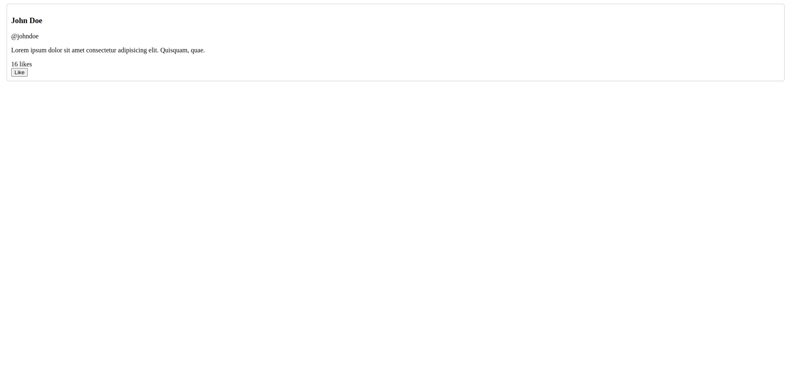
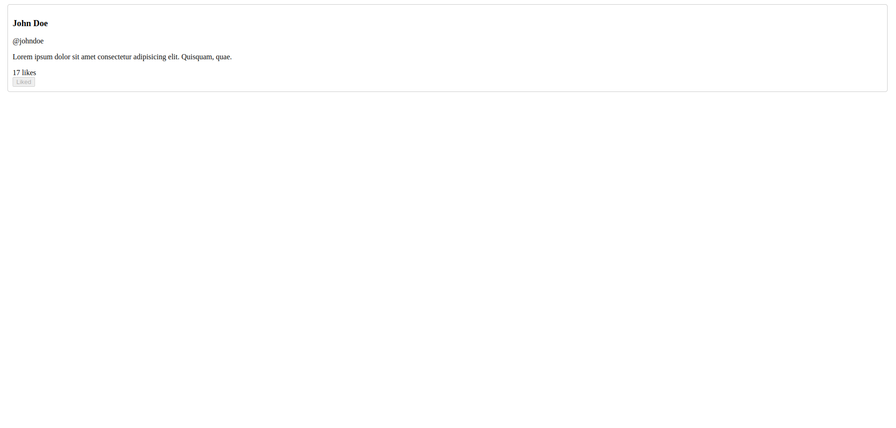
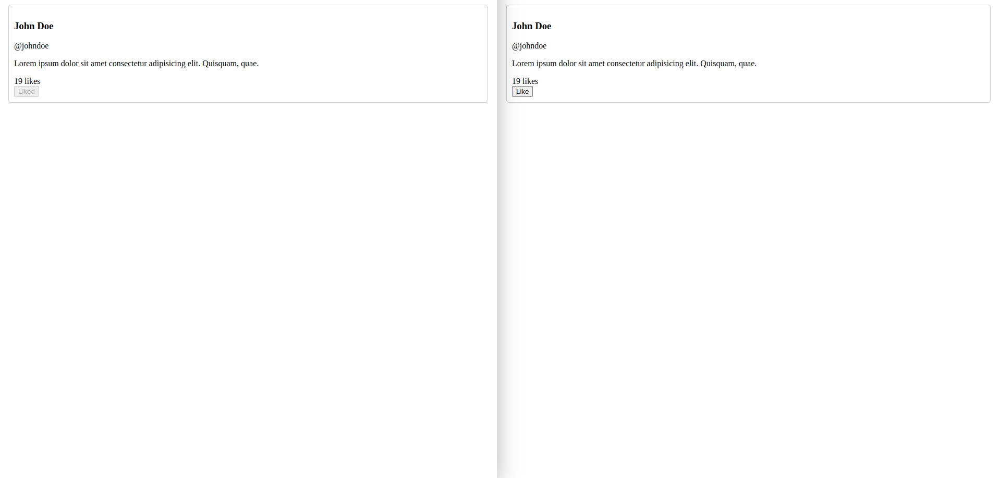

# How Social Media Websites Use WebSockets to Build Real-Time Applications

## Introduction

A big part of social media websites like Instagram and Twitter is being able to see who is interacting with your post. For a long time, statistics such as like and comment counts were rendered once when the application loaded and then didn’t change until the application was reloaded.

This all changed with the advent of a technology called “WebSockets”. Normally, when a website is loaded the browser makes a request for a certain page or resource, the server returns it, and then the connection is closed. With WebSockets, the server is able to keep a connection open and send data at any time.

This is crucial to real-time applications, like the aforementioned social media websites and websites where it’s important that the data is displayed as soon as it comes. For example, at my job, we build POS and management software for resale franchises. As a part of this, we have an interface that shows text messages between the store and its customers. It’s important that these messages update in real time so that employees can respond quickly.

## Guide

To get started, I have built a sample Twitter-like application that communicates with a server to show users the likes a specific “tweet” has. Building an entire application from scratch is a bit out of the scope of this guide since the focus is on implementing WebSockets to add real-time functionality to the application. You can find the source code for the starting point here [link to repo]. To implement the backend I am using ExpressJS, a commonly used library for building web servers.

This is a very small web application to highlight the power of WebSockets, so it is not very complicated. Let’s take a quick look at how it works.



As you can see, we have one “tweet” and a like count that persists. I can like the tweet each time I load the page by clicking the “Like” button.



But what happens if I have two instances of the app loaded and I like the tweet?


It looks like I can see the updated like count on the page I clicked the button on, but it doesn’t get updated on the other page. I can refresh the page to see the updated count, but that's not a very good user experience.

Let’s go ahead and fix this using WebSockets.

### Adding WebSocket Support to Our Server

To build out this functionality, we're going to use a library built for JavaScript called `ws`. You can install it by running the following in the project directory using a terminal:

```bash
$ npm install ws
```

Now, we're going to create a folder called `websockets` with a single file in it called `index.js`. This file will contain the logic pertaining to our WebSocket. Breaking this logic out in to its own file will help our project stay organized as it grows in complexity.

In the file you just created, add the following code:

```js
// websockets/index.js

const WebSocket = require('ws');
const fs = require('fs');

module.exports = (server) => {
  const wss = new WebSocket.Server({ server });

  wss.on('connection', (ws) => {
    //connection is up, let's add a simple simple event
    ws.on('message', (_message) => {
      // read number of likes from db.txt
      const numLikes = parseInt(fs.readFileSync('db.txt', 'utf8'));

      // add 1 to number of likes and write to db.txt
      fs.writeFileSync('db.txt', String(numLikes + 1));

      // send back the new number of likes to all clients
      wss.clients.forEach((client) => {
        if (client.readyState === WebSocket.OPEN) {
          client.send(numLikes + 1);
        }
      });
    });

    // send the like count from db.txt
    const numLikes = parseInt(fs.readFileSync('db.txt', 'utf8'));
    ws.send(numLikes);
  });
};
```

So, what's going on here?

In the first two lines we are importing some other libraries for convenience. The `fs` library lets us interact with our filesystem so we can update and read from the "database". The `ws` library has the bulk of the code for implementing a WebSocket server, but there is still some configuration we need to do to get it working for our use.

On the `module.exports` line, we are defining an exported function that takes in an HTTP server as an argument. Inside this function we create a new WebSocket server using the passed in `server` parameter.

Next, we are defining what the WebSocket server should do when it receives a new 'connection' event. Whenever a new 'connection' event is received, we go ahead and define what should happen when the server gets a new 'message' event, and send back the current number of likes the tweet has in the database.

Whenever a 'message' is received from an existing connection, we want to increase the number of likes by 1, write that to the database, and broadcast this change to all connections.

That's about it for creating the WebSocket handler! Now we just need to use it with our server.

In `index.js` add the following line before the `server.listen...` line but after the `const server = ...` line:

```js
// index.js
require('./websockets')(server);
```

Now we should be able to handle WebSockets on the server! Let's go ahead and implement this on the client side so we can test it.

### Using WebSockets in HTML

In order to take advantage of the new WebSocket functionality, we need to update the `index.html` file as well.

First, we need to create some new functions in the body of the `<script>` tag on line 29:

```js
// index.html

let ws;

const createWebSocket = () => {
  ws = new WebSocket('ws://localhost:3000/liveLikes');
  ws.onmessage = ({ data }) => {
    updateLikeCount(data);
  };
};

const likeTweetWs = () => {
  ws.send(
    JSON.stringify({
      type: 'like',
    })
  );
  disableLikeButton();
};

// getLikes()
createWebSocket();
```

First, we defined a new variable called `ws` to store our WebSocket connection.

The first function we wrote is called `createWebSocket`. This function is response for creating the WebSocket connection, and defining what should happen when the client receives a message. In our case, we want to update the like count with the message data.

The other function is called `likeTweetWs`, which will use the WebSocket connection to send some data to the server to effectively update the number of likes. We also want to disable the like button after they like the tweet so that they can't spam the button and inflate the likes.

Finally, notice that I commented out the `getLikes` function and called the `createWebSocket`. Since we are now using WebSockets, we don't need to get likes the old way.

There is now only one thing left to do before we can see our likes update in real time! We need to change the `onclick` event of the like button on line 26. It is currently using the old `likeTweet()` function, but we need to change it to use `likeTweetWs()` so that it will update using the WebSocket connection.

And that's it! Let's go ahead and test the new functionality.

### The Moment of Truth

First, let's open a single page and ensure that we can still like a tweet.


Ok, looks like that is still working. Now for the moment of truth. Does the count automatically update on other instances of the app?



Sweet! We now have a real time like count, much like you would see on popular social media sites like Twitter and Instagram

## Conclusion
